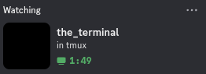

# discaml - dicord rich presence cli client

`❯ discaml -n "the_terminal" -t 3 -s "in tmux"`
<br><br>



## Help
```
❯ discaml --help
discaml cli arguments:
  -id client id
  -n set name
  -d set details
  -s set state
  -t set type (https://discord.com:2053/developers/docs/events/gateway-events#activity-object-activity-types)
  -start set started unix milis timestamp
  -tick seconds to wait between sending activity to discord
  -debug debug logs
  -script script that outputs name,details,state and be called each tick (output format is `name=somename;details=somedetails;state=somestatus`, supported keys are `name,state,details,type,started`)
  -sock set discord ipc unix socket (or just pass `$(ss -lx | grep -o '[^ ]*discord[^ ]*' | head -n 1)`)
  -image set image
  -help  Display this list of options
  --help  Display this list of options
```

## Build

### Using dune
```
dune bulid
```

### Using Nix
```
nix buli
```

## Nix home-manager module

- more info on the options can be found in `./module.nix`

```nix
# input in flake
inputs.discaml.url =  "github:crolbar/discaml";
...

# import module
imports = [inputs.discaml.homeManagerModules.default];

...


# use module
programs.discaml = {
  enable = true;
  clientId = 1262546798552158330;
  scriptPath = toString (pkgs.writers.writeBash "discaml-up" ''
    echo "\
    image=https://raw.githubusercontent.com/crolbar/disc.nvim/refs/heads/master/res/ocaml.png;\
    type=3;\
    started=$(($(date +%s%3N) - 49020000))\
    "
  '');
  tick = 5;
  activity = {
    name = "helix";
    details = "the greatest editor";
    state = "";
    type = 3;
    started = 0;
    image = "https://raw.githubusercontent.com/crolbar/disc.nvim/refs/heads/master/res/ocaml.png";
  };
};
```
